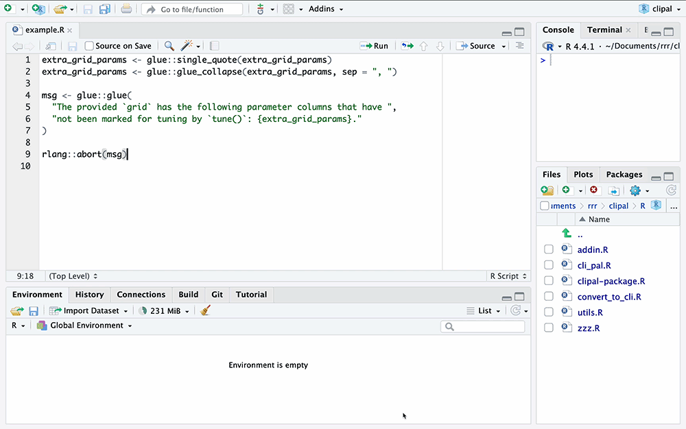

<!-- README.md is generated from README.Rmd. Please edit that file -->

```{r, include = FALSE}
knitr::opts_chunk$set(
  collapse = TRUE,
  comment = "#>",
  fig.path = "man/figures/README-",
  out.width = "100%"
)
```

# Your cli pal 

<!-- badges: start -->
[](https://lifecycle.r-lib.org/articles/stages.html#experimental)
[](https://CRAN.R-project.org/package=clipal)
<!-- badges: end -->

A couple years ago, the tidyverse team began migrating to the cli R package for raising errors, transitioning away from base R (e.g. `stop()`), rlang (e.g. `rlang::abort()`), glue, and homegrown combinations of them. cli's new syntax is easier to work with as a developer and more visually pleasing as a user.

In some cases, transitioning is as simple as Finding + Replacing `rlang::abort()` to `cli::cli_abort()`. In others, there's a mess of ad-hoc pluralization, `paste0()`s, glue interpolations, and other assorted nonsense to sort through. Total pain, especially with thousands upon thousands of error messages thrown across the tidyverse, r-lib, and tidymodels organizations.

clipal ("c-l-i pal") is an RStudio add-in that helps you convert your R package to use cli for error messages. It's vaguely correct most of the time, and greatly speeds up the process for converting error messages to cli, in my experience.

**This package is deprecated in favor of the more general [pal](https://github.com/simonpcouch/pal) package. To create a cli pal with pal, use `pal("cli")`.**

## Installation

You can install clipal like so:

``` r
pak::pak("simonpcouch/clipal")
```

Then,

* Ensure that you have an `ANTHROPIC_API_KEY` set in your [`.env`](https://github.com/gaborcsardi/dotenv). If you'd like to use an LLM other than Anthropic's Claude 3.5 Sonnet to power the cli pal, see `?cli_pal()` to set default metadata on that model. 
* Assign the "Convert to cli" addin the shortcut "Ctrl+Shift+C". (See instructions below if needed!)

## Example

The package provides an RStudio add-in "Convert to cli" that we suggest registering with the keybinding "Ctrl+Shift+C". To do so, navigate to Tools > Modify Keyboard Shortcuts > Search "Convert to cli", and add the keybinding. After selecting some code, press the keyboard shortcut and wait a moment:



See the [Gallery](#gallery) for more a varied set of examples.

## Cost

The system prompt from a cli pal includes something like 4,000 tokens. Add in (a generous) 100 tokens for the code that's actually highlighted and also sent off to the model and you're looking at 4,100 input tokens. The model returns approximately the same number of output tokens as it receives, so we'll call that 100 output tokens per refactor.

As of the time of writing (October 2024), the default clipal model Claude Sonnet 3.5 costs \$3 per million input tokens and $15 per million output tokens. So, using the default model, **cli pals cost around \$15 for every 1,000 refactored pieces of code**. GPT-4o Mini, by contrast, doesn't tend to get cli markup classes right but _does_ return syntactically valid calls to cli functions, and it would cost around 75 cents per 1,000 refactored pieces of code.

## Gallery

This section include a handful of examples ["from the wild"](https://github.com/tidymodels/tune/blob/f8d734ac0fa981fae3a87ed2871a46e9c40d509d/R/checks.R) and are generated with the default model, Claude Sonnet 3.5. 

The `cli_pal()` function instantiates a cli pal and is a light wrapper around functions creating [elmer](https://github.com/hadley/elmer) chats.

```{r}
library(clipal)

cli_pal()
```

The `convert_to_cli()` function takes an R expression that raises a condition and converts it to use cli. At its simplest, a one-line message with a little bit of markup:

```{r}
convert_to_cli({
  rlang::abort("`save_pred` can only be used if the initial results saved predictions.")
})
```

The function knows to look for the most recently defined cli pal, but you can pass one manually via `convert_to_cli(cli_pal)` if you please. 

Some strange vector collapsing and funky line breaking:

```{r}
convert_to_cli({
  extra_grid_params <- glue::single_quote(extra_grid_params)
  extra_grid_params <- glue::glue_collapse(extra_grid_params, sep = ", ")

  msg <- glue::glue(
    "The provided `grid` has the following parameter columns that have ",
    "not been marked for tuning by `tune()`: {extra_grid_params}."
  )

  rlang::abort(msg)
})
```

A message that probably best lives as two separate elements:

```{r}
convert_to_cli({
  rlang::abort(
    paste(
      "Some model parameters require finalization but there are recipe",
      "parameters that require tuning. Please use ",
      "`extract_parameter_set_dials()` to set parameter ranges ",
      "manually and supply the output to the `param_info` argument."
    )
  )
})
```

Gnarly ad-hoc pluralization:

```{r}
convert_to_cli({
  msg <- "Creating pre-processing data to finalize unknown parameter"
  unk_names <- pset$id[unk]
  if (length(unk_names) == 1) {
    msg <- paste0(msg, ": ", unk_names)
  } else {
    msg <- paste0(msg, "s: ", paste0("'", unk_names, "'", collapse = ", "))
  }
  rlang::inform(msg)
})
```

Some `paste0()` wonk:

```{r}
convert_to_cli({
  rlang::abort(paste0(
    "The workflow has arguments to be tuned that are missing some ",
    "parameter objects: ",
    paste0("'", pset$id[!params], "'", collapse = ", ")
  ))
})
```

The model is instructed to only return a call to a cli function, so erroring code that's run conditionally can get borked:

```{r}
convert_to_cli({
  cls <- paste(cls, collapse = " or ")
  if (!fine) {
    msg <- glue::glue("Argument '{deparse(cl$x)}' should be a {cls} or NULL")
    if (!is.null(where)) {
      msg <- glue::glue(msg, " in `{where}`")
    }
    rlang::abort(msg)
  }
})
```

Sprintf-style statements aren't an issue:

```{r}
convert_to_cli({
  abort(sprintf("No such '%s' function: `%s()`.", package, name))
})
```


